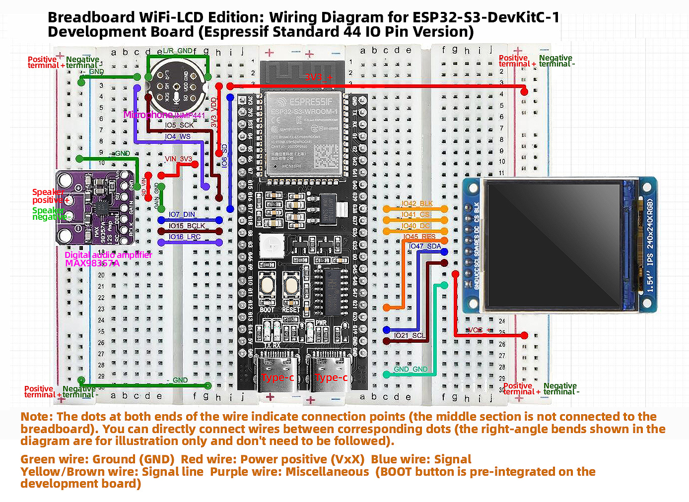
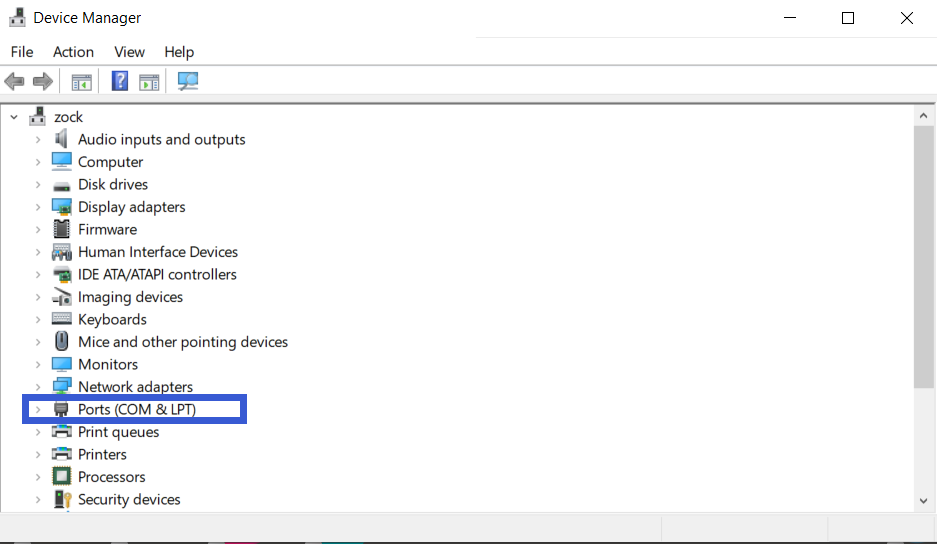

# Xiao Zhi AI Chatbot Breadboard DIY Kit with 1.54-Inch Display Screen

## Introduction
This is a DIY kit utilizing simple hardware and speech recognition technology, allowing you to quickly build a prototype of the "Xiao Zhi AI Chatbot" on a breadboard. It includes key components such as the ESP32-S3-DevKitC-1 development board, MEMS digital microphone (INMP441), digital amplifier (MAX98357A), 1.54-inch Display Screen, cavity speaker, and other essential elements. The kit supports voice input and playback and has reserved interfaces for further expansions, enabling basic human-machine interaction functionality.

## Key Features
- **Easy Setup, Quick to Get Started**: All components can be plugged into the breadboard without complex soldering skills.  
- **Voice Input**: Built-in MEMS digital microphone (INMP441) effectively reduces environmental noise interference.  
- **Audio Output**: The combination of digital amplifier (MAX98357A) and cavity speaker provides clear speech playback.  
- **Expandable**: Extra GPIO and I²C interfaces are reserved for easily adding more sensors or functional modules to the robot.  
- **Learning-Friendly**: Hands-on building and debugging allow users to gain a deeper understanding of the basic principles of AI voice recognition and playback.  

## Required Hardware

| Hardware Name                    | Specifications/Model                      | Main Uses                                  | Related Images (Example) |
|---------------------------|------------------------------------|-------------------------------------------|------------------|
| Development Board                | ESP32-S3-DevKitC-1 (WROOM N16R8 module) | Main control board, responsible for running firmware, processing voice and network connections |  |
| Digital Microphone               | INMP441                                   | Audio input collection                     |  |
| Amplifier                        | MAX98357A                                 | Audio output driver (converts digital signals to analog audio) |  |
| Cavity Speaker                   | 8Ω 2~3W or 4Ω 2~3W                       | Speaker for sound output                   |  |
| Jumper Wires                     | A box of jumper wires, several Dupont wires | Connection between modules and development board |  |
| Breadboards (2 pieces)           | 400 holes, modular                     | Convenient for direct connection of various electronic components |  |
| 1.54-Inch Display Screen          | ST7789 Driver                          | Displays WiFi status, dialogue information, and other prompts |  |
| Type-C Data Cable                | For firmware flashing                     | Connects the development board to a PC for firmware uploading and debugging |  |

## Hardware 

### 1. ESP32-S3-DevKitC-1 Development Board

The ESP32-S3-DevKitC-1 is a high-performance development board based on the Espressif ESP32-S3 series chip, integrating 2.4 GHz Wi-Fi and Bluetooth 5.0/BLE wireless connectivity, and featuring a dual-core Xtensa® LX7 processor with a maximum clock speed of 240 MHz. It supports hardware acceleration for machine learning, enabling efficient inference in AI scenarios such as voice recognition and image processing. Here are its main features and key parameters.

## Main Features

- **High-Performance Processing**  
  - Xtensa® LX7 dual-core architecture, with a maximum clock speed of 240 MHz  
  - Supports machine learning hardware acceleration to improve AI application inference speed

- **Wireless Connectivity**  
  - Integrated 2.4 GHz 802.11 b/g/n Wi-Fi  
  - Supports Bluetooth 5.0 and Bluetooth Low Energy (BLE), facilitating short-range communication in various scenarios

- **Multiple Interfaces**  
  - Up to 38 GPIO pins  
  - Built-in various communication protocols: ADC (12-bit), DAC, PWM, I2C, SPI, UART, etc.  
  - Onboard LED indicator, along with Boot, Reset, and other functional buttons

- **Security Features**  
  - Hardware encryption engine (AES, SHA, RSA, etc.)  
  - Supports Secure Boot and Flash Encryption, providing multiple levels of protection from hardware to firmware

- **Low Power Design**  
  - Standby power as low as approximately 10 μA, optimized power consumption during Wi-Fi operation  
  - Suitable for battery-powered projects or projects requiring long battery life

- **Development Ecosystem**  
  - Supports Arduino IDE for quick onboarding  
  - Compatible with ESP-IDF, PlatformIO, and other advanced development frameworks, facilitating custom projects

### 2. MEMS Digital Microphone (INMP441)

#### Introduction  
The INMP441 is a MEMS-based digital microphone with built-in amplification, analog-to-digital conversion, and I²S output. Compared to traditional analog microphones, it effectively reduces noise interference, making it suitable for applications in voice recognition and interaction.

#### Features  
1. **I²S Digital Output**: Outputs digital audio directly, avoiding interference from analog cables.  
2. **Compact Size, Easy Integration**: Suitable for projects with space constraints.  
3. **Low Power Consumption**: Ideal for battery-powered scenarios.  
4. **High Sensitivity**: Capable of capturing faint sounds, making it well-suited for voice recognition.  
5. **Built-in Voltage Regulation and Clock**: Reduces external circuit requirements, simplifying soldering.  
6. **Soldering Difficulty**: It is recommended to use a pre-soldered module to reduce difficulty.

#### Key Parameters

| Parameter        | Value / Range             | Description                                           |
|------------------|---------------------------|------------------------------------------------------|
| **Operating Voltage** | 3.3V (typical)         | Recommended range 1.8V ~ 3.3V                      |
| **Output Interface** | I²S                      | Left aligned, single-channel output                  |
| **Signal-to-Noise Ratio** | ~61 dB               | Higher SNR ensures better sound quality              |
| **Sensitivity**  | -26 dBFS (typical)       | Measured under 94 dB SPL, 1kHz input conditions     |
| **Frequency Response Range** | 60 Hz ~ 15 kHz (typical) | Meets most human voice capture needs                 |
| **Current Consumption** | 1.1 mA ~ 1.7 mA       | Typical operating current                             |
| **Package Size** | 3.76 mm × 2.95 mm        | Requires fine soldering technique                     |

### 3. Digital Amplifier (MAX98357A)

#### Introduction  
The MAX98357A is a highly integrated Class D audio amplifier chip that can directly amplify digital audio via I²S input. It eliminates the need for traditional DACs required in amplifiers, resulting in higher efficiency and smaller size, widely used in portable speakers, smart speakers, and other products.

#### Features  
1. **I²S Digital Input**: No additional DAC required, simplifying design.  
2. **High Efficiency Class D**: Over 90%, suitable for battery-powered scenarios.  
3. **Built-in Filtering/PLL**: Adapts to various sampling rates for stable and reliable output.  
4. **Simplified Peripheral Circuits**: Requires only minimal capacitors and resistors to operate.  
5. **Protection Mechanisms**: Includes overcurrent and overheating protection, making it safer to use.  
6. **Drives Various Speakers**: Can power 4Ω/8Ω speakers, suitable for low-power audio applications.

#### Key Parameters

| Parameter         | Value / Range        | Description                     |
|--------------------|---------------------|---------------------------------|
| **Operating Voltage** | 2.5V ~ 5.5V        | Commonly 3.3V or 5V             |
| **Output Power**    | 3W@4Ω / 2W@8Ω      | Depends on voltage and heatsinking conditions |
| **Efficiency**      | Over 90%            | Effectively reduces energy loss   |
| **Sampling Rate**   | 8kHz ~ 96kHz       | Built-in PLL supports various formats |
| **Total Harmonic Distortion + Noise (THD+N)** | < 0.03% @1W, 5V | Ensures good sound quality       |
| **Protection Features** | Overheat / Overcurrent / Short-circuit | Increases safety at use         |

> **Note**: It is recommended to leave sufficient heat dissipation space and correctly match the speaker impedance, as well as set the gain properly to avoid distortion or chip damage.

### 4. Cavity Speaker (8Ω 2W)

#### Introduction  
This type of speaker works in a closed or semi-closed cavity, optimizing low frequencies and concentrating sound energy. It is commonly found in portable speakers and smart voice devices.

#### Features  
1. **Impedance and Power Matching**: 8Ω, 2W power, suitable for small amplifiers.  
2. **Enhanced Low Frequency**: Cavity design helps enhance low-frequency extension.  
3. **Compact and Easy to Install**: Often equipped with clips or screw holes for integration.  
4. **Wide Range of Usage**: Suitable for various environmental volume needs.

#### Key Parameters

| Parameter          | Value / Range       | Description                          |
|---------------------|---------------------|-------------------------------------|
| **Impedance**       | 8Ω                   | General specification, matches small amplifiers |
| **Rated Power**     | 2W                   | Suitable for everyday volume scenarios |
| **Frequency Response** | ~200Hz ~ 20kHz     | Optimized low-frequency performance  |
| **Sensitivity**     | 80~90 dB (@1W/1m)   | Higher sensitivity for better efficiency |
| **Installation Method** | Screws/Clip/Adhesive | Varies by specific model            |

> **Note**: It is recommended to use a suitable digital amplifier (e.g., MAX98357A) and calibrate the volume to avoid overload that can cause distortion or damage.

### 5. Boxed Jumper Wires

**Boxed Jumper Wires Introduction**  
Boxed jumper wires consist of various types of DuPont wires (male-to-male, male-to-female, female-to-female) packaged in small compartments based on length and color. They are suitable for rapid prototyping and connection in breadboard or circuit projects.

**Key Features**  
1. Various wire lengths and interface types to accommodate different wiring needs.  
2. Colorful designs make circuit paths easy to distinguish.  
3. Boxed design for convenient storage and portability.

### 6. Breadboard (2 pieces, 400 holes, modular, optional, recommended)

The breadboard can be used for quickly building and debugging prototype circuits without soldering, effectively managing line connections and avoiding messy wiring. The 400-hole design is sufficient to accommodate common modules and jumper wires, and it can be expanded by connecting multiple boards for larger areas. It allows for easy insertion and layout adjustment of components, suitable for electronic enthusiasts and beginners.

> **Tip**: Make effective use of the power and ground line layout on the breadboard to improve circuit tidiness and stability.

### 7. 1.54-Inch IPS Display Screen Module

#### Introduction
The 1.54-inch IPS Display Screen module is a high-performance display suitable for a wide range of electronic projects and products. This module uses advanced IPS technology, which can provide rich colors and clear display effects, making it ideal for applications that require high visibility. Its compact size and simple interface design make it very suitable for embedded development and portable devices.

#### Features
- **High Resolution Display**: A resolution of 240x240 pixels ensures clear images with rich details.
- **Rich Colors**: Supports RGB 65K color display, which can present more vivid and realistic images.
- **Wide Viewing Angle**: IPS technology provides ultra-wide viewing angles, maintaining excellent image quality even from larger angles.
- **Simple Interface**: Uses a 4-wire SPI serial bus interface, requiring only a few I/O pins for connection.
- **Wide Compatibility**: Provides a wealth of examples for STM32, C51, and MSP430, making it easy to develop and integrate.
- **Military-Grade Standards**: Compliant with military-level processes to ensure long-term stable operation in various environments.
- **Technical Support**: Offers low-level driver technical support to help developers get started quickly.

#### Product Parameters

| Name               | Parameter                       |
|-------------------|---------------------------------|
| **Display Color**  | RGB 65K                        |
| **SKU**           | MSP1541                        |
| **Size**          | 1.54 inch                     |
| **Panel Material** | TFT                            |
| **Driver Chip**   | ST7789                         |
| **Resolution**    | 240 x 240 pixels              |
| **Display Interface** | 4-line SPI interface         |
| **Effective Display Area (AA Area)** | 27.72 x 27.72 mm       |
| **Touch Screen Type** | None                        |
| **Touch IC**      | None                           |
| **Module PCB Size** | 32.00 x 43.72 mm             |
| **Viewing Angle**  | Full Angle                    |
| **Operating Temperature** | -10℃ ~ 60℃               |
| **Storage Temperature** | -20℃ ~ 70℃               |
| **Operating Voltage** | 3.3V                       |
| **Power Consumption** | To be determined            |

## Wiring Instructions

### Pin Connections for ESP32S3 Development Board and Modules

#### 1. Wiring between ESP32S3 Development Board and Microphone
| **ESP32S3 Development Board**         | **Microphone INMP441 (I2S Interface)**                       |
|---------------------------------------|-------------------------------------------------------------|
| GPIO **4**                            | **WS** Data Select                                          |
| GPIO **5**                            | **SCK** Data Clock                                         |
| GPIO **6**                            | **SD** Data Output                                         |
| **3V3**                                 | **VDD** Power Positive 3.3V                               |
| **GND**                                 | **GND** Ground **Short Connect** **L/R** Left Right Channel |

---

#### 2. Wiring between ESP32S3 Development Board and Digital Amplifier

| **ESP32S3 Development Board**         | **Digital Amplifier MAX98357A**                             |
|---------------------------------------|-------------------------------------------------------------|
| GPIO **7**                            | **DIN** Digital Signal                                      |
| GPIO **15**                           | **BCLK** Bit Clock                                         |
| GPIO **16**                           | **LRC** Left Right Clock                                   |
| **3V3** / 3.3V                        | **Vin (or VCC)** Power Input **Short Connect** **SD** Shutdown Channel |
| **GND**                                 | **GND** Ground **Short Connect** GAIN Gain and Channel (do not connect on BGA packaged microphone) |
|                                       | **Audio+** Connect to **Speaker Positive** (usually **red wire**, test with a multimeter if necessary) |
|                                       | **Audio-** Connect to **Speaker Negative**                  |

---

#### 3. Wiring between ESP32S3 Development Board and 1.54-Inch IPS Display Screen

| ESP32S3 Pin     | Display Screen Pin   | Function Description          |
|-----------------|------------------|-------------------------------|
| GND             | GND              | Ground                        |
| 3V3             | VCC              | Positive Power (3.3V)        |
| GPIO21          | SCL              | SPI Clock Signal              |
| GPIO47          | SDA              | SPI Data Signal               |
| GPIO45          | RES              | Reset Signal                  |
| GPIO40          | DC               | Data/Command Select Signal    |
| GPIO41          | CS               | Chip Select Signal            |
| GPIO42          | BLK              | Backlight Control Signal (High to light up) |

---

### Wiring Steps Diagram for ESP32S3 Development Board and Each Module

**First, a complete picture**

The first step is to clip the breadboards together, which is simple to do.

The second step shows that the breadboard has 6 protrusions on top.

Start connecting the ESP32 development board. Align the board starting from the left side A1 and press against the bottom hole.

The third step begins the wiring, paying attention to align with the pins. If unsure, refer to the numbers. The wiring for the round INMP441 is as follows:

Then insert the INMP441 as shown.

The fourth step shows the connection for the MAX98357:

Next, connect the amplifier: the three orange wires should align with the amplifier's LRC/BCLK/DIN.

The fifth step shows the wiring for the color LCD screen:

Final completion image.

Now you can proceed to the next step, which is network configuration.

### Common Wiring Issues FAQ

1. **After flashing the firmware, the RGB light does not turn on**  
   - Please check whether the solder joints around the RGB light are properly soldered. If there are any unsoldered places, you can first use wires to connect the corresponding pads and check if the light functions normally after restarting.

2. **How to check for circuit faults?**
- **When not powered**: You can use a multimeter to measure continuity between wires and GND or 3.3V pins to check for short or open circuits.  
   - **When powered**: Measure the voltage values between GND and other pins to see if they are within normal ranges (e.g., 5V, 3.3V); if abnormal, further check the corresponding module and connections.

3. **What to do when contact problems frequently occur when using the breadboard?**  
   - This may be due to aging breadboard sockets or oxidation of component pins. You can try replacing the breadboard, cleaning the component pins, or using shorter jumper wires to reduce points of failure.

4. **How to connect the grounds of sensors, power modules, etc.?**  
   - The ground of external modules should be connected to the GND of the main control board, ensuring they all share the same ground line to avoid noise or signal stability issues.

> **Tip**: If you encounter troubleshooting that is difficult to locate, consider checking if the power supply is stable (e.g., 5V or 3.3V) and ensure that the firmware version and sample code correspond to the actual wiring.

## Flashing Firmware (Without IDF Development Environment)

This guide applies to the **ESP32-S3-WROOM-N16R8** version for firmware flashing, using the **Flash Download Tool**.

**One-click download for the flashing tool**

 [**Flashing Tool**](Tool.rar)

**One-click download for flashing firmware**

 [**Flashing Firmware**](Firmware.zip)

---

### 1. Preparation

- **Operating System**: Using Windows as an example, it is recommended to use **Flash Download Tool 3.9.7** (or other newer versions).  
- **Obtain the Tool**: Download from [Espressif's official website](https://www.espressif.com.cn/zh-hans/support/download/other-tools) and extract it to any folder without needing installation.  
- **Running Method**: Enter the extracted directory and double-click `flash_download_tool_3.9.7.exe` to start.

---

### 2. Downloading Firmware

**One-click download for firmware**

 [**Flashing Firmware**](刷机固件.zip)

Click to download, then extract the file.

2. **Copy the `.bin` File to the Specified Directory**  
   - Place the extracted `v1.5.5_bread-compact-wifi-LCD-7P-240x240.bin` in the **bin** directory of the **Flash Download Tool** for easier subsequent operations.

---

### 3. Flashing Firmware to the Development Board

After extracting and entering the `flash_download_tool_3.9.7` directory, double-click to run `flash_download_tool_3.9.7.exe`. The interface will look as follows:

#### 1) Download Settings

1. **Chip Type (ChipType)**: Select `ESP32-S3`  
2. **Working Mode (WorkMode)**: Select `Develop`  
3. **Loading Mode (Download Mode)**: It is recommended to choose `UART` (if selecting USB, additional settings are required; not covered here).

**Interface and sRGB Explanation**:  
- When the Type-C interface of the development board is facing you, the right port is the **UART** port, and the left port is the **USB** port; please do not confuse them.  
- If the onboard sRGB light has not been soldered, the tool may show a warning when identifying (this does not affect flashing) and can be resolved by shorting the solder pads later (see the end of the document).

---

#### 2) Load Firmware & SPI Download Settings

1. **Input Firmware Path**: Click the `...` button in the first blank field to select the `v1.5.5_bread-compact-wifi-LCD-7P-240x240.bin` file.

2. **Check Firmware Option**: Check the checkbox next to the imported `.bin` file, and in the address bar, input `0x0` or `0x00` to indicate that it will be flashed to the beginning address in storage.  
3. **COM Port**: In the system's "Device Manager," expand the serial port section to view the corresponding **COM port number** and select the same port in the tool. 

4. **Speed Settings**: The default SPI speed is sufficient; you can choose a higher `BAUD` rate to speed up the flashing process.

5. **Start Flashing**: Click `START`. The progress bar will begin running until a successful **FINISH** prompt appears. This entire process typically takes a few minutes to over ten minutes, depending on the firmware size and speed settings.

---

### Flashing Complete

Once the flashing is complete, press the `RST (Restart)` button on the development board (shown in the diagram below) to restart the board, allowing it to enter **Wi-Fi configuration mode**. Configuration operations are detailed in the subsequent instructions.

## How to Configure Device Wi-Fi

### 1. Wi-Fi Network Configuration

#### 1) Start the Device
- After flashing the firmware, keep the device powered on and press the **RST** button (shown in the diagram below) to restart, which will put the device in configuration mode.  

#### 2) Configuration Status
- **sRGB Color Light Blinking Blue**: Indicates that it is in configuration mode.  
- **sRGB Color Light Not On**: See section 2 of this page for details.  
- If the device is not in configuration mode or needs to be reconfigured, press and hold the **configuration button (connected to GPIO 1)**, then press the **RST** button to reset; first, release RST, then release the configuration button to re-enter configuration mode.  
- For firmware versions ≥0.2.2, if three attempts to connect to the original Wi-Fi fail, it will automatically revert to configuration mode (you can press RST to restart the device when switching networks).

#### 3) Configuration Steps
1. **Connect to "Xiao Zhi" Wi-Fi**  
   Use your phone or computer to connect to the Wi-Fi emitted by the device (the name typically resembles *Xiaozhi-XXXXXX*).

2. **Configure the Network**  
   Click on the found Wi-Fi name *Xiaozhi-XXXXXX* to connect, which will automatically redirect to the configuration page:
  

   > - Select 2.4G Wi-Fi (if using an iPhone hotspot, you need to enable “maximum compatibility”).  
   > - Input the password, then click **Connect**.  
   > - If successfully connected, the interface will display “Done” and automatically restart after 3 seconds.

If automatic redirection to the configuration page does not occur, you can also manually enter `http://192.168.4.1` in the browser's address bar to access the configuration page.

---

### 2. About the RGB Color Light on the Device

1. **Connection and Update Status**  
   - When powered on, if the blue light blinks once, the device is connecting to Wi-Fi; if the **green light blinks afterward**, it indicates a successful connection and that the device can be awakened by voice.  
   - If the blue light stays on: the device is performing OTA firmware updates, which usually complete in under a minute.  
   - If the blue light keeps blinking: the device is in configuration mode.  
   - If the blue light turns on during voice awakening: it indicates that it is connecting to the server.  
   - If the green light is on: the device is playing audio.  
   - If the red light is on: the device is recording audio.

2. **RGB Light Not Turning On**  
   - If the light switch has not been soldered, it will not affect Wi-Fi configuration but will prevent you from checking the device status.

---

### 3. How to Add a Device

1. **Confirm Device Is Online**  
   - Once the device connects to the network, it will announce a 6-digit verification code (which can be retrieved by awakening it again).

2. **Access Control Panel**  
   - Open the [Xiaozhi AI Chatbot - Control Panel](https://xiaozhi.me/) by entering [https://xiaozhi.me](https://xiaozhi.me) in your browser (if you don’t have an account, you may register). Click on the top right corner to switch to your preferred language.  

Once you've changed the language, click **console** to enter the control panel.

3. **Device Management**  
   - Create an agent,
    

   - Set your agent's name.  
   

   - Click “Add New Device”.  
   
     
   Enter the 6-digit **Device ID**.  

     

   **Where to obtain the Device ID**: After successful firmware upload and network configuration, the device will automatically announce the six-digit code.

4. **Activation Successful**  
   - The device will automatically activate and display on the “Device Management” page. Click **Configure Role** to enter the configuration interface.  
   

   - Configure the assistant's name and voice. In the Role Introduction section, you can use AI tools to write a description of the character you desire.  
   

   - Configure AI big models, which allow several optional settings. After determining the settings, save them.  
   

Restart the Xiao Zhi AI Chatbot to start chatting!

